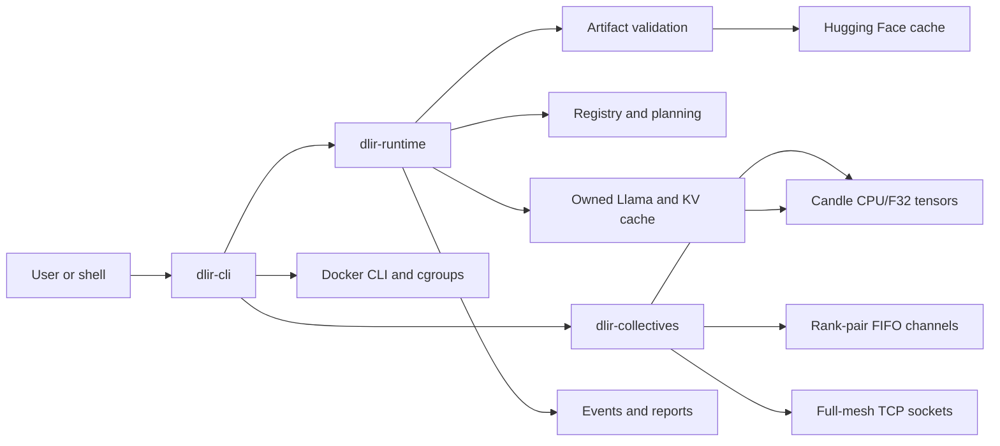
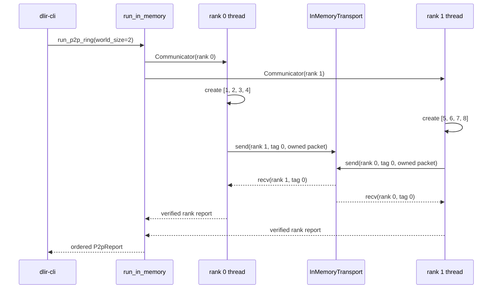
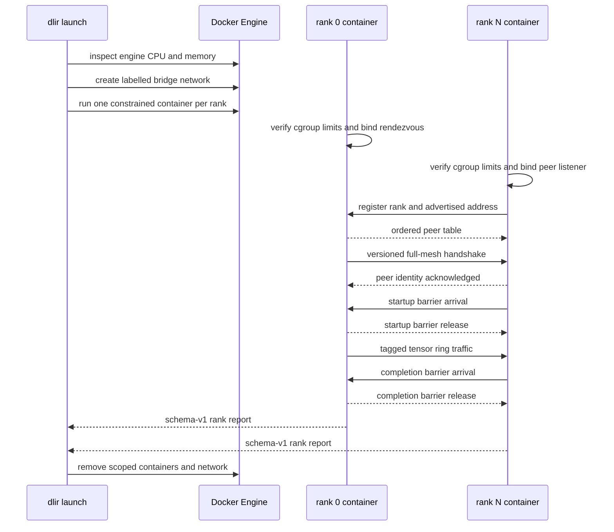
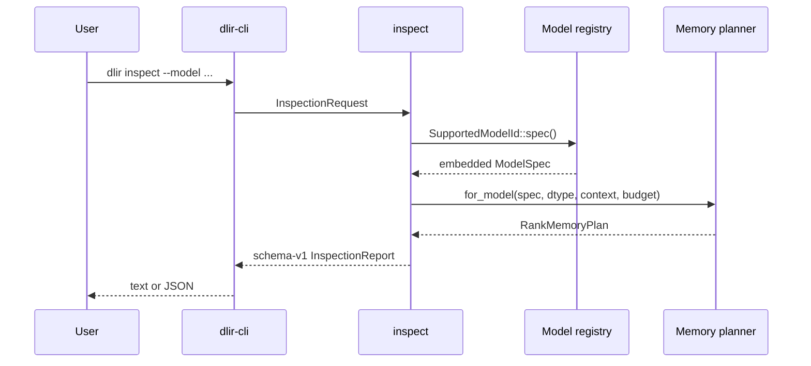
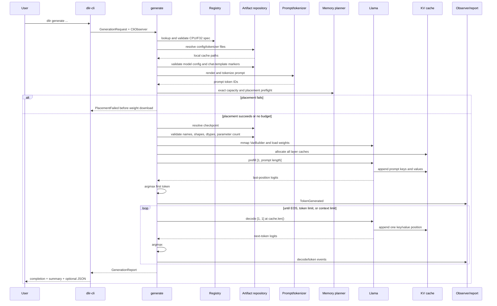

# Architecture and request flow

`v0.1-single` remains the control experiment for model execution. All model weights, compute, KV
state, token selection, and generation reporting belong to rank 0. `v0.2-collectives` adds a
separate communication path with logical ranks; `v0.3-tcp` gives each rank its own process and
Docker container. Neither checkpoint distributes model execution.

```text
world_size = 1
rank       = 0
TP         = 1
PP         = 1
EP         = 1
```

For the in-memory point-to-point path:

```text
one rank = one worker thread = one logical CPU device
```

For the TCP Docker path:

```text
one rank = one process = one container = one logical CPU device
```

## Workspace boundaries



`dlir-cli` depends on both first-party libraries; neither library depends on the CLI. The runtime
and collectives crates are independent in v0.2 because model generation still has world size one.

## First-party module map

| Module | Responsibility | Main concepts |
| --- | --- | --- |
| [`cli/main.rs`](../crates/cli/src/main.rs) | Parse arguments; render text/JSON; stream completion | Interface boundary, stdout/stderr |
| [`cli/launch.rs`](../crates/cli/src/launch.rs) | Plan resources and manage Docker rank processes | Container lifecycle, cgroups |
| [`collectives/lib.rs`](../crates/collectives/src/lib.rs) | Export the p2p API | Rank and transport boundary |
| [`collectives/in_memory.rs`](../crates/collectives/src/in_memory.rs) | Connect rank pairs with channels | FIFO messages, tags, timeouts |
| [`collectives/tcp.rs`](../crates/collectives/src/tcp.rs) | Rendezvous and connect rank processes | TCP framing, peer mesh, barrier |
| [`collectives/tensor.rs`](../crates/collectives/src/tensor.rs) | Copy tensors into owned packets | Dtype, shape, values |
| [`collectives/runner.rs`](../crates/collectives/src/runner.rs) | Run and join rank workers | Thread ownership, failure propagation |
| [`registry.rs`](../crates/runtime/src/registry.rs) | Describe the only accepted models | Reproducibility, architecture contract |
| [`artifacts.rs`](../crates/runtime/src/artifacts.rs) | Resolve and validate Hub files | Staged loading, trust boundary |
| [`prompt.rs`](../crates/runtime/src/prompt.rs) | Render fixed chat templates | Prompt representation, special tokens |
| [`inspect.rs`](../crates/runtime/src/inspect.rs) | Build network-free inspection reports | Architecture metadata |
| [`memory.rs`](../crates/runtime/src/memory.rs) | Count parameters and persistent bytes | Placement planning, GQA cache size |
| [`model/llama.rs`](../crates/runtime/src/model/llama.rs) | Load and execute the supported Llama subset | Transformer forward pass |
| [`model/cache.rs`](../crates/runtime/src/model/cache.rs) | Preallocate and append layer K/V state | Autoregressive state |
| [`generation.rs`](../crates/runtime/src/generation.rs) | Orchestrate artifacts, prefill, decode, and timing | Request lifecycle |
| [`report.rs`](../crates/runtime/src/report.rs) | Define stable events and report records | Observability contract |
| [`error.rs`](../crates/runtime/src/error.rs) | Describe expected failure categories | Fail-fast validation |

## Point-to-point flow



Every rank sends before receiving. This is safe because the in-memory channels are unbounded. The
tensor packet owns its shape and values, so receiving constructs a new Candle tensor rather than
sharing the sender's tensor handle. See
[Ranks and point-to-point communication](ranks-and-point-to-point.md).

## TCP Docker flow



See [TCP rendezvous and barrier](tcp-rendezvous-and-barrier.md) and
[Docker resource topologies](docker-topologies.md).

## Inspection flow

Inspection deliberately stops before artifacts or tensors:



No `ArtifactRepository` is constructed, so inspection is deterministic and network-free. A failed
placement is report data, not an inspection error.

## Generation flow



## Architectural invariants

The implementation defends these properties at module boundaries:

- A model ID always maps to exactly one pinned specification.
- Generation executes only CPU/F32; inspection may model other logical dtypes.
- Batch size is exactly one.
- A forward call's `position` equals the current cache length.
- Prompt tokens are never silently truncated.
- Cache capacity never exceeds the registered model context.
- Checkpoint tensors must exactly match the expected manifest.
- Only the final sequence position is projected to next-token logits.
- All events and memory plans identify rank 0.
- JSON report shapes are versioned independently of human text output.
- A communication rank belongs to exactly one validated world.
- Point-to-point peers are distinct ranks in that world.
- Rank boundaries transfer owned CPU/F32 tensor values, never shared tensor handles.
- A receive matches both source rank and message tag under one total deadline.
- Rendezvous accepts one registration for every contiguous rank and one run ID.
- A TCP world owns one bidirectional connection for every distinct rank pair.
- Barrier generations advance only after every rank arrives.
- Docker launches pass only when requested and observed cgroup limits agree.

These invariants turn accidental mismatches into explicit errors close to their source. Unit tests
beside the owning modules exercise the corresponding success and failure paths.
