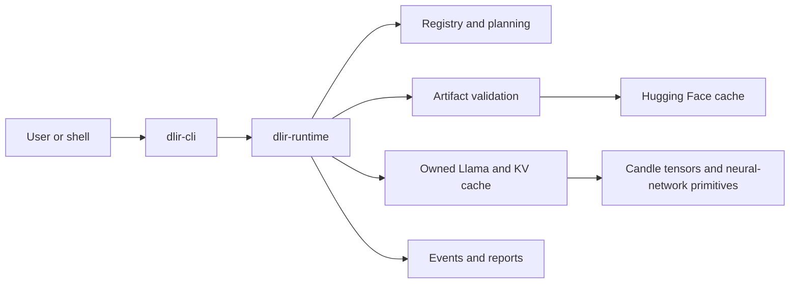
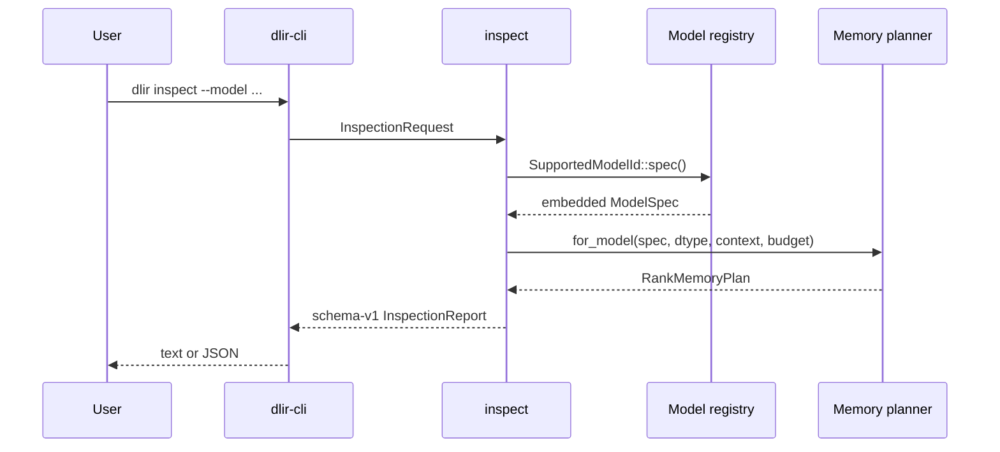
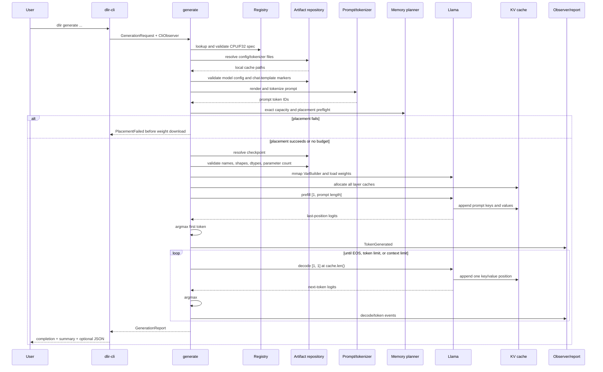

# Architecture and request flow

`v0.1-single` is the control experiment for later distributed checkpoints. All model weights,
compute, KV state, token selection, and reporting belong to rank 0.

```text
world_size = 1
rank       = 0
TP         = 1
PP         = 1
EP         = 1
```

## Workspace boundaries



`dlir-cli` depends on `dlir-runtime`; the runtime never depends on the CLI. This direction lets a
future interface consume the same requests, events, and reports without duplicating inference.

## First-party module map

| Module | Responsibility | Main concepts |
| --- | --- | --- |
| [`cli/main.rs`](../crates/cli/src/main.rs) | Parse arguments; render text/JSON; stream completion | Interface boundary, stdout/stderr |
| [`registry.rs`](../crates/runtime/src/registry.rs) | Describe the only accepted models | Reproducibility, architecture contract |
| [`artifacts.rs`](../crates/runtime/src/artifacts.rs) | Resolve and validate Hub files | Staged loading, trust boundary |
| [`prompt.rs`](../crates/runtime/src/prompt.rs) | Render fixed chat templates | Prompt representation, special tokens |
| [`inspect.rs`](../crates/runtime/src/inspect.rs) | Build network-free inspection reports | Architecture metadata |
| [`memory.rs`](../crates/runtime/src/memory.rs) | Count parameters and persistent bytes | Placement planning, GQA cache size |
| [`model/llama.rs`](../crates/runtime/src/model/llama.rs) | Load and execute the supported Llama subset | Transformer forward pass |
| [`model/cache.rs`](../crates/runtime/src/model/cache.rs) | Preallocate and append layer K/V state | Autoregressive state |
| [`generation.rs`](../crates/runtime/src/generation.rs) | Orchestrate artifacts, prefill, decode, and timing | Request lifecycle |
| [`report.rs`](../crates/runtime/src/report.rs) | Define stable events and report records | Observability contract |
| [`error.rs`](../crates/runtime/src/error.rs) | Describe expected failure categories | Fail-fast validation |

## Inspection flow

Inspection deliberately stops before artifacts or tensors:



No `ArtifactRepository` is constructed, so inspection is deterministic and network-free. A failed
placement is report data, not an inspection error.

## Generation flow



## Architectural invariants

The implementation defends these properties at module boundaries:

- A model ID always maps to exactly one pinned specification.
- Generation executes only CPU/F32; inspection may model other logical dtypes.
- Batch size is exactly one.
- A forward call's `position` equals the current cache length.
- Prompt tokens are never silently truncated.
- Cache capacity never exceeds the registered model context.
- Checkpoint tensors must exactly match the expected manifest.
- Only the final sequence position is projected to next-token logits.
- All events and memory plans identify rank 0.
- JSON report shapes are versioned independently of human text output.

These invariants turn accidental mismatches into explicit errors close to their source. Unit tests
beside the owning modules exercise the corresponding success and failure paths.
