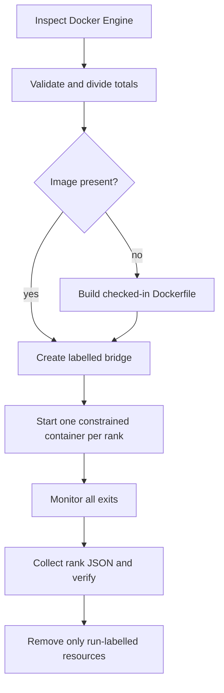

# Docker resource topologies

`dlir launch` turns an explicit total resource budget into one enforced container budget per rank.
It divides execution capacity, not model weights.

## Planning resources

For world size `N`:

```text
rank_cpu_millis = floor(total_cpu_millis / N)
rank_memory      = floor(floor(total_memory / N) / MiB) × MiB
```

Remainders are reported and left unused. The launcher requires at least `0.1` CPU and `128 MiB`
per rank and rejects requested totals greater than the CPU and memory exposed by `docker info`.

For example:

```console
dlir launch --nproc 4 --total-cpus 2 --total-memory 1GiB
```

produces four identical plans of `0.5` CPU and `256 MiB`.

## Enforcement and read-back

Each container is created with:

```text
--cpus <rank quota>
--memory <rank bytes>
--memory-swap <same rank bytes>
```

`--cpus` is a scheduling quota, not exclusive core pinning. Memory is a hard cgroup maximum, and
setting memory-swap equal to memory prevents the topology from silently gaining extra swap
capacity.

Before opening a socket, each rank reads cgroup v2 `cpu.max`, `memory.max`, `memory.current`, and
the effective cpuset. Cgroup v1 paths are supported as a fallback. CPU must agree within one
millicpu and memory must agree exactly with the whole-MiB plan. A missing or different enforced
limit fails the rank and therefore the launch.

## Container lifecycle



The image is cached as `dlir:v0.3-tcp`; `--rebuild` uses a fresh build. Container names, network,
and labels include the run ID. No port is published to the host. Normal completion, failure, and
interrupt cleanup target only the exact names created by that launch. `--keep-containers` retains
stopped resources for debugging and never removes the cached image.

## Report meaning

The schema-v1 launch report separates three views:

- Docker Engine capacity;
- requested, allocated, unused, and headroom totals;
- per-rank requested and observed limits plus TCP/barrier correctness.

Machine-dependent engine capacity and run IDs mean Docker JSON is not byte-for-byte deterministic.
The topology calculation and ring values are deterministic for the same explicit inputs.

These limits become useful placement inputs for later rank-local model partitions. In v0.3 the
single-process inference path remains `world_size = 1`, and no checkpoint is loaded by rank
containers.
