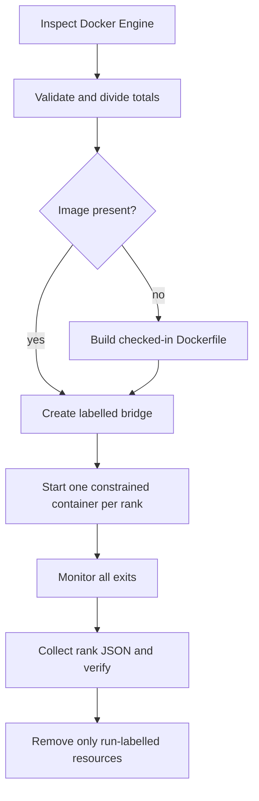

# Docker resource topologies

`dlir launch` and `dlir pipeline` turn an explicit total resource budget into one enforced
container budget per rank. The equal division is execution capacity; only the pipeline stage plan
decides which model weights each rank materializes.

## Planning resources

For world size `N`:

```text
rank_cpu_millis = floor(total_cpu_millis / N)
rank_memory      = floor(floor(total_memory / N) / MiB) × MiB
```

Remainders are reported and left unused. The launcher requires at least `0.1` CPU and `128 MiB`
per rank and rejects requested totals greater than the CPU and memory exposed by `docker info`.

For example:

```console
dlir launch --nproc 4 --total-cpus 2 --total-memory 1GiB
```

produces four identical plans of `0.5` CPU and `256 MiB`.

## Enforcement and read-back

Each container is created with:

```text
--cpus <rank quota>
--memory <rank bytes>
--memory-swap <same rank bytes>
```

`--cpus` is a scheduling quota, not exclusive core pinning. Memory is a hard cgroup maximum, and
setting memory-swap equal to memory prevents the topology from silently gaining extra swap
capacity.

Before opening a socket, each rank reads cgroup v2 `cpu.max`, `memory.max`, `memory.current`, and
the effective cpuset. Cgroup v1 paths are supported as a fallback. CPU must agree within one
millicpu and memory must agree exactly with the whole-MiB plan. A missing or different enforced
limit fails the rank and therefore the launch.

## Container lifecycle



The topology command defaults to `dlir:v0.3-tcp`; pipeline generation defaults to
`dlir:v0.4-pipeline`. `--rebuild` uses a fresh build. Container names, network, and labels include
the run ID. No port is published to the host. Normal completion, failure, and interrupt cleanup
target only the exact names created by that launch. `--keep-containers` retains stopped resources
for debugging and never removes the cached image. For pipeline runs it also preserves and prints
the host request-manifest directory.

## Report meaning

The schema-v1 launch report separates three views:

- Docker Engine capacity;
- requested, allocated, unused, and headroom totals;
- per-rank requested and observed limits plus TCP/barrier correctness.

Machine-dependent engine capacity and run IDs mean Docker JSON is not byte-for-byte deterministic.
The topology calculation and ring values are deterministic for the same explicit inputs.

In `dlir launch`, the limits prove only topology and no checkpoint is loaded. In `dlir pipeline`,
each rank's `StageMemoryPlan` is compared with the exact enforced memory limit before checkpoint
download. The estimate includes local logical F32 weights and local KV capacity, while observed
`memory.current`/`memory.max` values are retained separately. Equal container limits do not imply
equal stage use and do not describe peak RSS.
