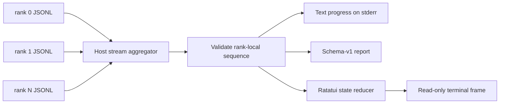

# Distributed events and the observational TUI

The terminal UI used by `v0.4-pipeline` and `v0.5-tensor` is a projection of instrumentation,
not a cluster manager. Rank execution
does not depend on Ratatui, and the UI cannot start, stop, retry, reconfigure, or send commands to
a rank.

## One event stream, three consumers

Every rank creates monotonically sequenced
[`PipelineEvent`](../crates/pipeline/src/event.rs) records. The process writes each record as one
flushed schema-versioned JSON line, followed by one final rank result. The host follows all
container logs concurrently and gives the same validated stream to:

1. the text progress observer;
2. the aggregate pipeline or tensor-parallel report; and
3. the [`DashboardState`](../crates/tui/src/lib.rs) reducer when `--tui` is active.

The host rejects an event whose embedded rank or next sequence number does not match the stream it
came from. It also assigns a separate `receive_sequence` as events arrive. Rank
`elapsed_ns` values come from different process-local monotonic clocks and must not be sorted as if
they shared a globally synchronized clock.

## Event vocabulary

[`RunEventKind`](../crates/runtime/src/report.rs) is shared by single-rank and distributed
execution. Distributed inference ranks publish the following lifecycle:

| Event | Meaning |
| --- | --- |
| `MemorySample` | Latest observed cgroup usage/limit attached to the run |
| `ModelLoadStarted/Finished` | Stage-local weight and cache construction boundary |
| `CollectiveStarted/Completed` | Startup or completion barrier generation |
| `PrefillStarted/Finished` | Rank-local prompt phase |
| `DecodeStepStarted/Finished` | Rank-local cached step |
| `LayerStarted/Completed` | Global layer executed by its owning stage, with local duration |
| `TensorSent/Received` | Activation peer, phase, step, shape, bytes, and duration |
| `ControlSent/Received` | Token/decision peer, phase, step, bytes, and duration |
| `TokenGenerated` | Rank-0 non-EOS token ID and available decoded fragment |
| `GenerationFinished` | Rank-local successful stop reason |
| `TensorCollectiveStarted/Completed` | Native collective algorithm, sequence, shape, bytes, and duration |

Pipeline ranks use generic collective events for barriers. Tensor ranks additionally emit native
collective events for broadcast, all-gather, and centralized or ring all-reduce phases.

## Reducer state

[`DashboardState::apply`](../crates/tui/src/lib.rs) is a deterministic reducer with no transport
or Docker dependency. It tracks:

- model, TCP backend, TP/PP/EP topology, and selected all-reduce algorithm;
- stage ranges or tensor shard ranges, current phase/layer/collective, and last
  compute/communication duration per rank;
- logical stage memory, observed cgroup current usage, and enforced limit;
- rank-0 prefill, TTFT, and mean completed decode duration;
- generated-token count and logical sent activation/control bytes; and
- recent token, completion, or invalid-rank activity.

Communication bytes count send events only, preventing one transfer from being counted at both
its sender and receiver. Per-rank reports separately retain sent and received counters.

## Terminal ownership and restoration

[`run_dashboard`](../crates/tui/src/lib.rs) writes only to stderr. It enters raw mode and the
alternate screen through a guard whose `Drop` implementation disables raw mode, leaves the
alternate screen, and restores the cursor on successful completion, errors, and Rust panics.

Controls have intentionally narrow semantics:

| Key | Effect |
| --- | --- |
| `q` or Esc | Disable visualization; text progress and generation continue |
| Ctrl-C | Return an interrupt request to the launcher, which stops only current-run containers |

`--tui` requires an interactive stderr terminal and fails explicitly otherwise. It never silently
falls back. Without `--tui`, assistant text stays on stdout and progress/metrics remain on stderr.

## Timing interpretation

The reducer calculates phase durations by subtracting a rank's own event timestamps. The final
report uses the rank-0 state machine's measured phase aggregates. Both avoid subtracting clocks
from different containers.

TTFT begins when rank 0 starts prefill after the stage is loaded and the startup barrier has
released. It ends when rank 0 receives and decodes the first non-EOS token. Cold-start timing is a
host measurement that also includes artifact work, image/container startup, rendezvous, and stage
loading.

Pipeline timings measure the current sequential schedule. A lower per-layer compute duration does not
mean stages overlap; at most one request microbatch exists, so downstream stages wait for the
activation chain on every token.

## Tests

The TUI uses Ratatui's `TestBackend` at normal and narrow terminal sizes. Reducer tests feed
synthetic events and verify prefill/TTFT/decode arithmetic, byte counting, and token state without
opening a terminal. Event recorder tests prove rank identity and sequence monotonicity, and report
round-trip tests protect the schema-v1 boundary. Tensor-specific snapshots also verify shard
labels and native-collective state.
