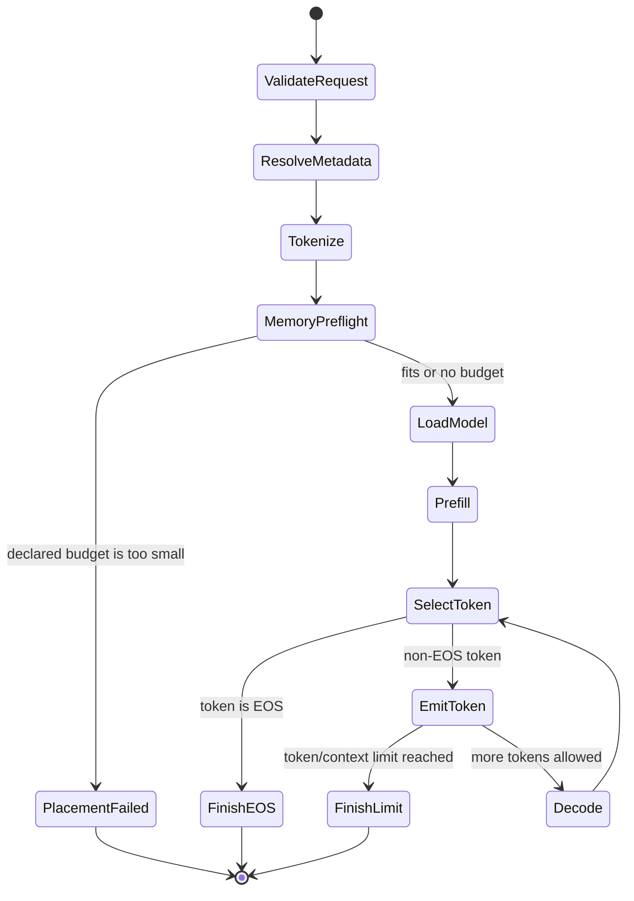

# KV cache and generation

Autoregressive inference repeatedly asks the same model for one next-token distribution. The
model parameters are reused unchanged; the growing state is the token history represented by the
per-layer key/value cache.

## Why cache keys and values

Without a cache, producing token `n + 1` would recompute attention keys and values for the prompt
and all `n` generated tokens. A KV cache retains those projections, so each decode forward
projects only the newest token.

Queries are not cached. A query is used once to ask which previous positions matter for the
current forward call. Keys and values must remain available to future queries.

## Cache representation

[`KvCache`](../crates/runtime/src/model/cache.rs) allocates one `LayerKvCache` per transformer
layer. Each layer owns:

```text
keys:   [1, K, C, D]
values: [1, K, C, D]
length: populated positions
```

`C` is fixed before model execution. `length` begins at zero. On append, `Tensor::slice_set`
writes the new `[1, K, S, D]` chunk at the current length, advances the length by `S`, and returns
views restricted to `0..length`.

All layers advance through the same token positions during a forward pass. `KvCache::len` reads
the first layer's length after the complete pass; `Llama::forward` requires its supplied
`position` to match that value.

## Capacity planning

After tokenization, generation chooses:

\[
\text{effective new tokens}
= \min(\text{requested new tokens},\ \text{model context} - \text{prompt tokens})
\]

\[
C = \text{prompt tokens} + \text{effective new tokens}
\]

This exact capacity drives the memory preflight, cache allocation, and RoPE table size. The prompt
is never truncated. If it already consumes the whole context, generation fails before loading
weights. If some space remains but less than requested, generation uses the remaining space and
eventually reports `context_limit`.

## Prefill and decode state machine



### Prefill

The prompt arrives as `[1, prompt_tokens]` with `position = 0`. One forward call processes all
prompt positions, fills every layer's K/V prefix, and returns logits only for the final prompt
position. Greedy selection from those logits produces the first generated token.

### Decode

If another token is allowed, the previously generated token is fed as `[1, 1]` at
`position = cache.len()`. The call appends one K/V position per layer and returns the next logits.
The loop repeats one token at a time.

This explains an initially surprising metric: generating 32 non-EOS tokens normally records 31
decode forwards. The first generated token comes from prefill logits; each later token needs one
decode forward.

It also explains why allocated and used cache bytes can differ. The last emitted token has not
been fed back through the model unless another decode step occurs.

## Greedy selection

`greedy_token` squeezes the batch dimension, performs `argmax` across the vocabulary, and returns
one token ID:

\[
t_{next} = \underset{i}{\operatorname{argmax}}\; \text{logits}_i
\]

There is no temperature, random seed, top-k/top-p sampling, or repetition penalty. Pinned
artifacts plus the same prompt therefore produce the same greedy token IDs.

## Token text and EOS

The tokenizer's decode stream incrementally converts generated token IDs into printable text.
Some token pieces do not immediately produce text; the observer can receive an empty string for
such a token. The final `completion` is decoded from the complete generated-token vector.

EOS is checked before emission. The forward pass that discovers EOS still counts in timing and
decode-forward totals, but EOS is not added to `generated_tokens` and its textual representation
is never printed.

## Stop reasons

| Stop reason | Meaning |
| --- | --- |
| `eos` | The selected next token was the model's EOS token |
| `max_new_tokens` | The requested number of non-EOS tokens was emitted |
| `context_limit` | Remaining model context was smaller than the requested generation |

Zero requested tokens and an empty prompt are invalid requests, not stop reasons. Cache overflow
and position mismatch are invariant violations and return errors rather than partial reports.

## Generation ownership

[`generation.rs`](../crates/runtime/src/generation.rs) owns orchestration, not transformer math. It
validates the request, sequences artifacts, measures operations, invokes `Llama::forward`, applies
argmax, emits events, and builds the report. [`model/llama.rs`](../crates/runtime/src/model/llama.rs)
owns tensor execution; [`model/cache.rs`](../crates/runtime/src/model/cache.rs) owns persistent
attention state.

Tests cover context exhaustion, context capping, exact placement boundaries, deterministic token
IDs, EOS/report behavior through real-model tests, and cache position/capacity invariants.
