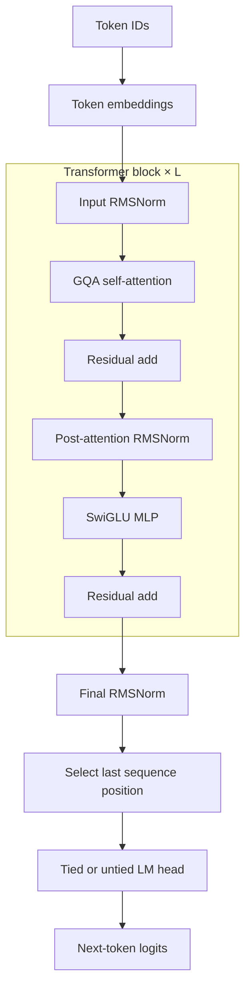

# The owned Llama forward pass

The runtime uses Candle for tensors and neural-network primitives but owns the supported Llama
execution graph. The implementation is in
[`model/llama.rs`](../crates/runtime/src/model/llama.rs); it does not call a prebuilt generation
pipeline.

## From token IDs to logits



Every call returns logits only for the final input position because autoregressive generation
needs only the distribution for the next token.

## Shape ledger

Let the current call contain `S` tokens and let `T = position + S` after appending this call to the
cache.

| Value | Shape | Rust operation |
| --- | --- | --- |
| Token IDs | `[1, S]` | Input to `Llama::forward` |
| Embeddings | `[1, S, H]` | `Embedding::forward` |
| Queries | `[1, Q, S, D]` | Q projection, reshape, transpose |
| New keys/values | `[1, K, S, D]` | K/V projection, reshape, transpose |
| Cached keys/values | `[1, K, T, D]` | `KvCache::append` populated prefix |
| Attention K/V view | `[1, Q, T, D]` | `repeat_kv` grouped expansion |
| Attention scores | `[1, Q, S, T]` | `Q × Kᵀ / √D` |
| Attention output | `[1, Q, S, D]` | probabilities × values |
| Merged attention | `[1, S, H]` | transpose and reshape |
| Final-position hidden state | `[1, H]` | select position `S - 1` |
| Logits | `[1, V]` | LM-head projection, returned as F32 |

The cache remains compact at `K` heads. Expansion to `Q` heads is an attention view, not permanent
cache storage.

## Embeddings and output head

The token embedding table has shape `[V, H]`. Looking up `[1, S]` token IDs produces `[1, S, H]`
hidden states.

If `tie_word_embeddings` is true, `Llama::load` constructs the LM head from the same embedding
tensor. Otherwise it loads a separate `[V, H]` `lm_head.weight`. This distinction affects both
checkpoint validation and parameter accounting.

## RMSNorm and residual paths

The implementation is a pre-normalized transformer block:

\[
x' = x + \operatorname{Attention}(\operatorname{RMSNorm}(x))
\]

\[
y = x' + \operatorname{MLP}(\operatorname{RMSNorm}(x'))
\]

RMSNorm scales a vector according to its root-mean-square magnitude without subtracting a mean.
Each block owns two `[H]` learned norm weights, and the model owns one final `[H]` norm.

The residual additions preserve shape `[1, S, H]` and allow information to bypass the attention
and MLP transformations.

## Grouped-query attention

The query projection produces `Q` heads while key and value projections produce only `K` heads.
The number of query heads sharing one KV head is:

\[
G = \frac{Q}{K}
\]

`ModelConfig::head_dim` rejects configurations where this is not integral. `repeat_kv` expands
each cached KV head across its `G` query heads for attention computation:

```text
Q heads 0 .. G-1       → KV head 0
Q heads G .. 2G-1      → KV head 1
...
```

Queries are ephemeral and are not cached. This is why persistent cache storage contains `K`, not
`Q`, heads and is smaller than the equivalent MHA cache when `K < Q`.

## Rotary position embeddings

Self-attention has no inherent concept of token order. RoPE rotates pairs of query and key
features by a position-dependent angle before their dot product.

For even feature index `2i`, the inverse frequency is:

\[
\theta_i^{-1} = \frac{1}{\text{rope\_theta}^{2i / D}}
\]

`RotaryEmbedding::new` precomputes sine and cosine tables only to the effective cache capacity,
not the model's full maximum context. `apply` narrows those tables from `position` for the current
`S` tokens. Values are not rotated.

The supported registry rejects RoPE scaling, so positions use the checkpoint's unscaled
`rope_theta` behavior.

## Causal masking

During a multi-token prefill, query position `q` must not attend to a key later than its absolute
position. The implementation marks a score as forbidden when:

\[
\text{key} > \text{position} + q
\]

Forbidden scores become negative infinity before softmax. During one-token decode, all visible
keys are at or before the current token, so the explicit mask can be skipped.

Attention scores and probabilities are computed in F32:

\[
P = \operatorname{softmax}\left(\frac{QK^T}{\sqrt{D}} + M\right)
\]

\[
A = PV
\]

The result is converted back to the input dtype, merged to `[1, S, H]`, and passed through the
output projection.

## SwiGLU MLP

The feed-forward path uses three unbiased projections:

\[
\operatorname{MLP}(x)
= W_{down}\left(\operatorname{SiLU}(W_{gate}x) \odot W_{up}x\right)
\]

`gate_proj` and `up_proj` map `H → I`; `down_proj` maps `I → H`. The elementwise product implements
the gate, and the final projection restores the residual-stream width.

## Synthetic walkthrough

The deterministic test fixture uses:

```text
H = 8, I = 12, L = 2, Q = 4, K = 2, D = 2, V = 19
prompt S = 3, cache C = 8
```

For prefill, Q has shape `[1, 4, 3, 2]`, new K/V have `[1, 2, 3, 2]`, and the populated cache
prefix has `[1, 2, 3, 2]`. Repeating each KV head twice yields `[1, 4, 3, 2]`; scores are
`[1, 4, 3, 3]`. The model returns `[1, 19]` logits for prompt position 2.

The next decode call supplies `[1, 1]` at `position = 3`. After append, K/V expose
`[1, 2, 4, 2]`, expanded K/V are `[1, 4, 4, 2]`, and scores are `[1, 4, 1, 4]`.

## What proves the forward pass

Tests build deterministic in-memory weights and run both tied and untied configurations. They
compare prefill and cached-decode logits with Candle's reference Llama at maximum absolute
difference `1e-4`. They also compare cached decode with recomputing the complete four-token
sequence. Position mismatches and cache overflow must fail explicitly.

The next chapter explains the stateful cache and generation loop around this otherwise pure model
calculation: [KV cache and generation](kv-cache-and-generation.md).
