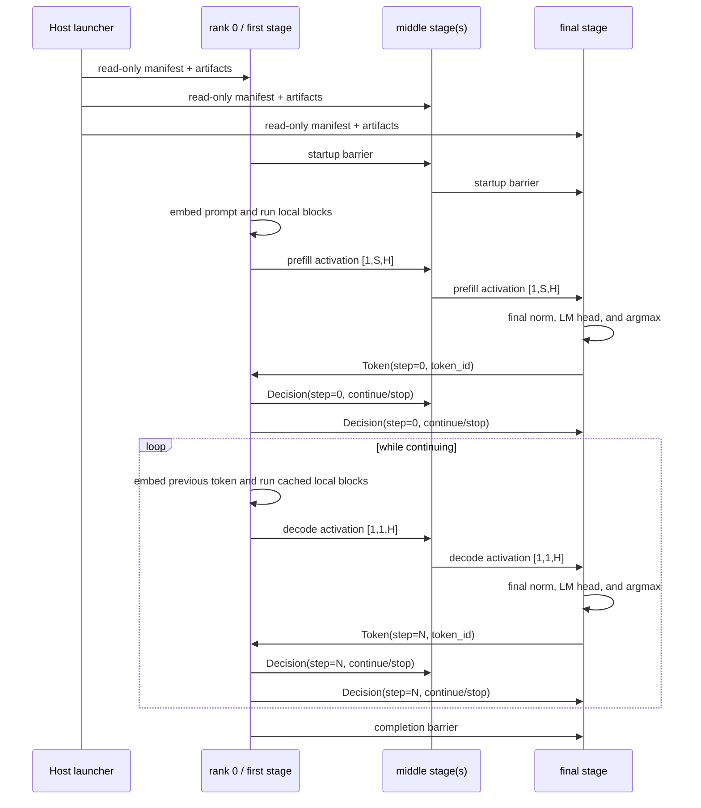

# Pipeline partitioning and execution

`v0.4-pipeline` is the first checkpoint where multiple physical ranks cooperate on one model
forward pass:

```text
one rank = one process = one Docker container = one CPU pipeline stage
```

The goal is correctness and inspectability. The schedule handles one prompt and one token at a
time; it does not overlap microbatches and therefore is not a pipeline-throughput optimization.

## Why partition by layers?

A Llama transformer is naturally an ordered chain. If rank 0 owns the first layers and rank 1
owns the remaining layers, the value crossing the boundary is the residual activation, not a
partial logit or a shard requiring a reduction:

```text
token IDs
  → embeddings + early layers on rank 0
  → [1, S, H] residual activation over TCP
  → later layers + norm + LM head on final rank
  → [1, V] logits remain local
```

This makes pipeline parallelism a useful first model-distribution strategy: a rank loads only its
assigned blocks and only caches keys and values for those blocks.

## Deterministic stage assignment

[`PipelinePartition::balanced`](../crates/pipeline/src/partition.rs) assigns contiguous layer
ranges. For `L` layers and `P` stages:

```text
base      = floor(L / P)
remainder = L mod P
```

Every stage receives `base` layers, and the lowest `remainder` ranks receive one additional
layer. A stage is represented by the half-open interval `[layer_start, layer_end)`.

For the 30-layer SmolLM2 registry entry:

| PP | Layer counts | Ranges |
| ---: | --- | --- |
| 2 | `15, 15` | `0..15`, `15..30` |
| 3 | `10, 10, 10` | `0..10`, `10..20`, `20..30` |
| 4 | `8, 8, 7, 7` | `0..8`, `8..16`, `16..23`, `23..30` |

Rank 0 additionally owns token embeddings. The final rank owns final RMSNorm and the LM head.
For a tied model, those components are in different processes, so the final rank materializes a
second copy of `model.embed_tokens.weight` as its output projection. The planner reports that
physical cross-rank duplication explicitly.

The partition rejects fewer than two stages, more than 64 stages, and any world larger than the
model's transformer-layer count. Consequently every rank always owns at least one block.

## Per-stage memory

[`StageMemoryPlan::for_stage`](../crates/pipeline/src/partition.rs) counts only the weights a rank
materializes and the KV cache for its local layers:

\[
M_{stage} = M_{local\ weights} + 2L_{local}CKDB
\]

where `C` is the request cache capacity, `K` is the number of KV heads, `D` is head dimension,
and `B=4` for F32. Query heads do not appear in the cache term; GQA stores compact K/V heads and
expands only the attention view.

Local weight ownership is:

| Component | Owning rank | Checkpoint names |
| --- | --- | --- |
| Token embeddings | rank 0 | `model.embed_tokens.weight` |
| Transformer blocks | assigned stage | `model.layers.{i}.*` |
| Final RMSNorm | final rank | `model.norm.weight` |
| LM head, untied | final rank | `lm_head.weight` |
| LM head, tied | final rank, duplicated | `model.embed_tokens.weight` |

The host compares every stage's persistent estimate with the equal enforced Docker memory limit.
Any failed stage aborts before checkpoint download. Equal limits do not imply equal use: rank 0
has embeddings, the final stage has norm/head ownership, and uneven layer counts produce
different stage estimates.

This remains a logical persistent estimate, not a promise about peak RSS. Activations, operator
workspace, allocator behavior, the runtime, and mapped checkpoint pages can add memory.

## Artifact and loading boundary

The host performs the following work once:

1. Resolve and validate the pinned configuration and tokenizer.
2. Render the registry-selected chat template and tokenize the prompt.
3. Calculate effective context capacity, stage assignments, and placement.
4. Resolve and validate the complete pinned safetensor manifest.
5. Write a schema-v1 [`PipelineManifest`](../crates/pipeline/src/report.rs).

The canonical checkpoint, tokenizer, configuration files, and manifest are bind-mounted read-only
into every container. Every process maps the same complete safetensors file, but
[`LlamaStage::load`](../crates/runtime/src/model/llama.rs) asks the `VarBuilder` only for its local
tensors. Mapping a full file is not the same as materializing every model weight as an F32 Candle
tensor.

Each rank independently validates the manifest, checkpoint metadata, assignment, expected cgroup
limits, and TCP world before loading. [`StageKvCache`](../crates/runtime/src/model/cache.rs)
allocates one `[1, K, C, D]` K tensor and one V tensor for every local block. RoPE tables are also
precomputed locally to `C`.

## Prefill and decode traffic

The state machine is implemented by
[`run_pipeline_rank`](../crates/pipeline/src/runner.rs). All ranks execute the same phase/step loop,
but stage ownership determines their input and output.



The complete shape ledger is:

| Boundary | Prefill | Cached decode |
| --- | --- | --- |
| Rank-0 token input | `[1, prompt_tokens]` | `[1, 1]` |
| Stage residual input/output | `[1, prompt_tokens, H]` | `[1, 1, H]` |
| Local compact K/V | `[1, K, prompt_tokens, D]` | append one position |
| Local cache allocation | `[1, K, C, D]` per K and V | same allocation |
| Final logits | `[1, V]` | `[1, V]` |

Only residual activations cross the stage chain. Logits never leave the final stage. Token IDs and
decisions use bounded typed control packets rather than F32 sentinel tensors.

## Protocol-v2 invariants

[`TcpTransport`](../crates/collectives/src/tcp.rs) keeps tensor and control frames distinct while
matching both source and [`MessageTag`](../crates/collectives/src/rank.rs). The three pipeline tag
namespaces are activation, token feedback, and decision; each includes the step. Unmatched frames
remain in the source-specific pending queue under one total receive deadline.

Pipeline validation rejects:

- a protocol, run, world, rank, peer, source, or destination mismatch;
- an oversized, malformed, truncated, or unsupported frame;
- a token or decision for a stale/different step;
- a decode activation not shaped `[1,1,H]`, or any activation with the wrong batch/hidden size;
- a prompt with no token or no remaining context;
- cache writes beyond capacity; and
- cgroup limits that differ from the host plan.

EOS is never emitted. Rank 0 stops on EOS, the effective context limit, or the requested maximum,
then sends the same decision to every other stage.

## Correctness evidence

The synthetic tests beside [`model/llama.rs`](../crates/runtime/src/model/llama.rs) build identical
deterministic weights for a monolithic Llama and 2-, 3-, and 4-stage executions. They compare
prefill and cached-decode logits at F32 tolerance `1e-4`, covering GQA plus tied and untied heads.

Additional offline tests prove:

- exact 30-layer and 22-layer balancing, complete coverage, and no empty stages;
- tied-head duplication and exact placement boundaries;
- tensor/control type separation and out-of-order tag matching in memory and over TCP;
- protocol control serialization, malformed controls, reusable barriers, timeout, and disconnect;
- event sequence ordering, report serialization, and TUI reduction/rendering.

The ignored real-model acceptance tests exercise the pinned SmolLM2 Docker pipeline and a
TinyLlama loopback world with one rank per OS process, comparing their token IDs with monolithic
generation. TinyLlama's Docker case additionally requires an Engine exposing at least 6 GiB.

## What this checkpoint does not claim

The schedule has no microbatching, interleaving, continuous batching, activation compression, or
custom stage layout. It remains CPU/F32 on one trusted Docker host over plain TCP. It does not add
fault recovery, multi-host Docker, TLS, CUDA, NCCL, tensor parallelism, expert parallelism, or any
collective beyond the reusable barrier.
