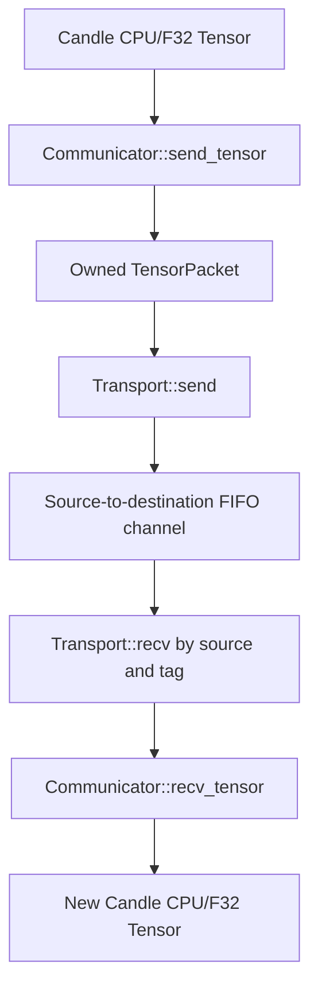
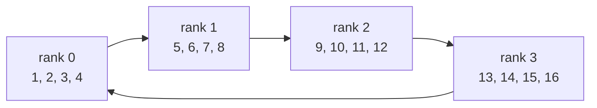

# Ranks and point-to-point communication

`v0.2-collectives` introduces the communication boundary used by later parallel inference work.
It intentionally stops at tensor `send` and `recv`: there is no barrier, collective algorithm,
network transport, or distributed model execution yet.

## Rank and world size

A rank is one participant in a distributed operation. `global_rank` identifies the participant;
`world_size` states how many participants belong to the same world.

For a world of four:

```text
world_size = 4
valid ranks = 0, 1, 2, 3
```

The runtime validates:

```text
world_size > 0
0 <= global_rank < world_size
0 <= peer < world_size
peer != global_rank
```

The final project intends each rank to live in its own process and device. This checkpoint first
proves the semantics with a smaller physical arrangement:

```text
one rank = one worker thread = one logical CPU device
```

Each worker receives one exclusive `InMemoryTransport` endpoint. Workers do not inspect another
rank's local tensor state.

## Transport and communicator layers

The implementation separates tensor concerns from message movement:



`Transport` works with `TensorPacket`, not Candle tensor handles. `Communicator` owns conversion at
both ends. A future TCP backend can serialize the same packet contract without changing callers.

## Why tensors are copied

Candle tensors may share storage internally. Sending the tensor object itself through a Rust
channel would let two logical ranks retain references to the same process memory. That would not
model the ownership boundary required when ranks later become separate processes.

`TensorPacket::from_tensor` therefore records:

| Field | v0.2 value |
| --- | --- |
| Dtype | F32, validated before transfer |
| Device | CPU, validated before transfer |
| Shape | Every tensor dimension |
| Values | Owned flattened `Vec<f32>` |

`TensorPacket::to_tensor` checks the shape's element count and constructs a new CPU tensor. Shape
multiplication uses checked arithmetic, and malformed packets fail before tensor construction.

## Source and tag matching

A receive names both the expected source and a `MessageTag`:

```rust
communicator.send_tensor(destination, MessageTag(7), &tensor)?;
let received = communicator.recv_tensor(source, MessageTag(7))?;
```

Each directional rank pair has a FIFO channel. If `recv(source, tag)` encounters a packet from the
same source with another tag, it retains that packet in a pending queue and continues waiting for
the requested tag. A later receive can retrieve the retained packet.

One total deadline covers the entire receive call. Encountering other tags does not restart the
clock. The CLI uses five seconds; tests use shorter configurable deadlines. Timeout and channel
disconnection are distinct errors.

## Deterministic ring exchange

`dlir p2p` makes every rank participate without introducing a collective operation:

```text
sent_to      = (rank + 1) mod world_size
received_from = (rank + world_size - 1) mod world_size
```

For four ranks:



Rank `r` creates four values beginning at `4r + 1`. All channels are unbounded, so each worker can
send before it receives without filling a channel and deadlocking. After receiving, it compares
dtype, shape, and values with the tensor expected from the previous rank.

## Worker lifecycle and failures

`run_in_memory` builds the complete world before starting workers. It then:

1. moves exactly one endpoint into each rank thread;
2. invokes the same worker closure for every communicator;
3. joins every thread even when one fails;
4. converts returned errors and panic payloads into rank-aware errors;
5. returns successful values ordered by global rank.

Dropping a failed worker's endpoint disconnects its outgoing channels. A peer waiting for that
rank receives a disconnection error rather than blocking indefinitely. The receive timeout is the
final safeguard for a live peer that never sends the requested tag.

## CLI report

Text output is intended for the article demonstration. JSON uses schema version 1 and contains:

- backend and ring-pattern identities;
- world size;
- rank-ordered sent/received tensor summaries and peer IDs;
- per-rank match results;
- one overall success value.

There are deliberately no timestamps, model fields, or generated events, so identical requests
produce deterministic JSON.

## What this proves

The checkpoint proves that rank-local workers can exchange owned tensors through a transport
contract and detect topology, type, shape, ordering, timeout, and lifecycle failures. It does not
yet prove inter-process or network behavior.

Barrier synchronization moves to `v0.3-tcp`. Tensor-parallel collectives such as all-reduce and
all-gather are introduced with the tensor-parallel execution that requires them.
