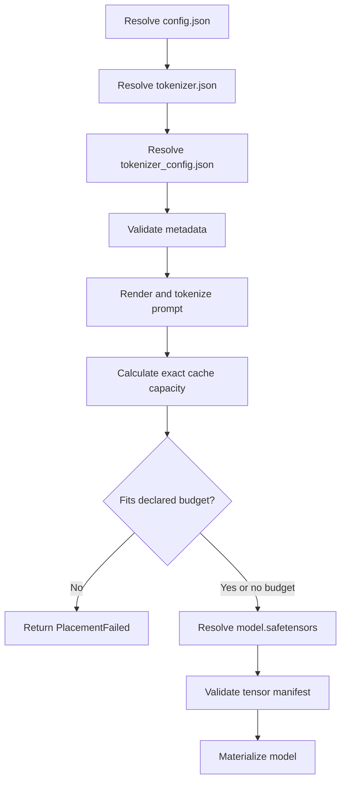

# Model registry, artifacts, and prompts

The registry is the runtime's declaration of what it knows how to execute. Artifact validation
checks that downloaded files still satisfy that declaration before the files influence model
construction.

## Why the registry is closed

A Hugging Face repository name does not fully describe an executable model. A compatible runtime
also needs to know the architecture, tensor layout, activation, biases, positional encoding,
special tokens, chat template, checkpoint dtype, and whether the output head shares embedding
weights.

`SupportedModelId` accepts only two stable CLI identifiers. Each maps to one `ModelSpec` in
[`registry.rs`](../crates/runtime/src/registry.rs):

| ID | Repository | Revision | Parameters | Checkpoint dtype |
| --- | --- | --- | ---: | --- |
| `smollm2-135m-instruct` | `HuggingFaceTB/SmolLM2-135M-Instruct` | `12fd25f77366fa6b3b4b768ec3050bf629380bac` | 134,515,008 | BF16 |
| `tinyllama-1.1b-chat` | `TinyLlama/TinyLlama-1.1B-Chat-v1.0` | `5243d158d6f4b356f1142ea8fd6a99cb5ac2c0e1` | 1,100,048,384 | BF16 |

The checkpoint is BF16 on disk, while v0.1 materializes weights as F32 for validated CPU
execution. Consequently, download size and logical runtime weight size are different quantities.

## `ModelSpec` as an executable contract

The specification contains four categories of information:

| Category | Representative fields | What depends on it |
| --- | --- | --- |
| Identity | ID, repository, revision, weight filename | Artifact resolution and reports |
| Integrity | parameter count, checkpoint bytes, dtype, tensor layout | Checkpoint validation |
| Architecture | `ModelConfig` | Memory formulas, tensor shapes, model construction |
| Execution policy | chat template, validated CPU support, unsupported CUDA state | Prompt rendering and request rejection |

`ModelConfig::head_dim` validates both `H % Q == 0` and `Q % K == 0`. The first makes heads a
well-defined shape; the second makes grouped-query sharing an integer number of query heads per KV
head.

## Staged artifact resolution

Generation deliberately separates small metadata from the large checkpoint:



This ordering means a declared placement failure happens before the checkpoint weight download.
Hugging Face's cache supplies local paths on later runs, but every run still validates the
metadata and checkpoint against the compiled contract.

## Metadata validation

[`validate_metadata`](../crates/runtime/src/artifacts.rs) requires:

- architecture `LlamaForCausalLM` and model type `llama`;
- SiLU activation;
- no attention or MLP biases;
- no RoPE scaling;
- every registered numeric and token field to match exactly;
- tokenizer configuration to contain the expected template markers.

The marker check is an integrity guard. The runtime does not execute arbitrary Jinja templates;
it uses a small, compiled `PromptTemplate` selected by the registry.

## Prompt rendering and tokenization

`render_prompt` replaces `{prompt}` in the selected fixed template. For SmolLM2, the rendered
structure is ChatML-like:

```text
<|im_start|>system
You are a helpful AI assistant named SmolLM, trained by Hugging Face<|im_end|>
<|im_start|>user
{prompt}<|im_end|>
<|im_start|>assistant
```

TinyLlama uses:

```text
<|user|>
{prompt}</s>
<|assistant|>
```

The tokenizer receives `add_special_tokens = false` because the rendered template already owns
the required special-token structure. The ignored golden tests download pinned tokenizers and
assert the exact token sequences, including that TinyLlama does not receive a duplicate BOS token.

## Tensor-manifest validation

Before model loading, [`validate_checkpoint`](../crates/runtime/src/artifacts.rs) opens the
safetensor metadata and builds the expected manifest from `ModelConfig`.

For each transformer layer, the expected weight shapes are:

| Tensor | Shape |
| --- | --- |
| `q_proj.weight` | `[H, H]` |
| `k_proj.weight` | `[K × D, H]` |
| `v_proj.weight` | `[K × D, H]` |
| `o_proj.weight` | `[H, H]` |
| `gate_proj.weight` | `[I, H]` |
| `up_proj.weight` | `[I, H]` |
| `down_proj.weight` | `[H, I]` |
| input RMSNorm | `[H]` |
| post-attention RMSNorm | `[H]` |

The model also requires `[V, H]` token embeddings, a final `[H]` norm, and an independent
`[V, H]` LM head only when embeddings are not tied. Validation rejects missing tensors,
unexpected tensors, wrong shapes, wrong checkpoint dtypes, and a wrong total parameter count.

## Memory-mapped loading boundary

Safetensor access uses Candle's unsafe mmap constructor in two isolated locations: manifest
validation and `VarBuilder` construction. The safety argument is narrow:

- the Hub cache path remains present and immutable while mapped;
- no mutable file handle is exposed;
- model tensors are materialized through the builder before the model is returned.

The unsafe boundary does not mean the checkpoint is trusted. Structural validation occurs before
the builder is used to construct the model.

## Failure mapping

| Condition | Error category |
| --- | --- |
| Unknown CLI model ID | `UnsupportedModel` |
| CPU dtype other than F32 | `UnsupportedExecution` |
| Unsupported architecture, activation, bias, or RoPE scaling | `CheckpointMismatch` |
| Registry/config disagreement | `CheckpointMismatch` |
| Missing template markers | `CheckpointMismatch` |
| Wrong tensor name, shape, dtype, or count | `CheckpointMismatch` |
| Empty user prompt | `EmptyPrompt` |
| Hub/cache failure | `Artifact` |
| Tokenizer load or encode failure | `Tokenizer` |

Unit tests beside `registry.rs`, `artifacts.rs`, and `prompt.rs` cover these contracts. Tests that
need pinned tokenizer or checkpoint downloads are explicitly ignored in the normal offline suite.
