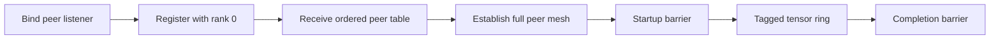

# TCP rendezvous and barrier

`v0.3-tcp` replaces thread-local channels with sockets while preserving the tensor-facing
`Communicator` contract. Every rank is now a separate process with a private address space.

## Startup phases



The peer listener is active before registration, so every address returned by rendezvous is ready
to accept connections. Rank 0 runs the one-shot rendezvous listener; no extra coordinator process
or container is required.

## Rendezvous contract

Each rank sends a bounded length-prefixed JSON registration containing:

| Field | Invariant |
| --- | --- |
| `protocol_version` | Exactly the version compiled into every rank |
| `run_id` | Equal across the complete world |
| `rank` | Unique and within `0..world_size` |
| `world_size` | Equal for every registration |
| `advertise_addr` | Non-empty and unique |

Rank 0 waits under one startup deadline and returns a rank-ordered `PeerInfo` table only after all
registrations validate. A duplicate, mismatch, oversized control message, or missing rank fails
the world rather than constructing a partial topology.

## Full mesh

For world size four, one bidirectional stream exists for each pair:

```text
connections = world_size × (world_size - 1) / 2 = 6
```

Lower ranks dial higher ranks while accept loops run concurrently. Every connection begins with a
handshake containing protocol, run, world, source, and destination identity. The stream is then
split into mutex-protected reader and writer handles, allowing either peer to send.

## Tensor wire frames

Tensor data uses an explicit little-endian binary frame:

```text
length | magic | version | kind | source | destination
       | tag | dimension count | element count | dimensions | F32 values
```

The receiver validates the 256 MiB frame bound, numeric conversions, shape product, payload size,
source, destination, and tag before constructing a new CPU tensor. TCP is a byte stream, so the
length prefix is what restores message boundaries. Unrequested tensor tags remain in the same
pending-message model used by `InMemoryTransport`.

## Reusable barrier

`BarrierTransport` is separate from basic `Transport`, so point-to-point implementations are not
forced to implement collectives. For generation `g`:

1. every nonzero rank sends `barrier_arrive(g)` to rank 0;
2. rank 0 waits for every arrival under one total deadline;
3. rank 0 sends `barrier_release(g)` to every peer;
4. each communicator advances to `g + 1` only after success.

Barrier frames have their own wire kinds and cannot collide with user message tags. Unexpected
generations, disconnection, or timeout fail explicitly. `InMemoryTransport` implements the same
reusable semantics with a condition variable and broken-generation state.

## Trust and failure boundary

TCP is intentionally unencrypted and unauthenticated in this checkpoint. The run ID prevents
accidental stale-world mixing but is not a credential. The supported topology is one trusted
Docker bridge on one engine. Cross-host routing, TLS, elastic membership, and recovery after a
rank disappears remain future work.
